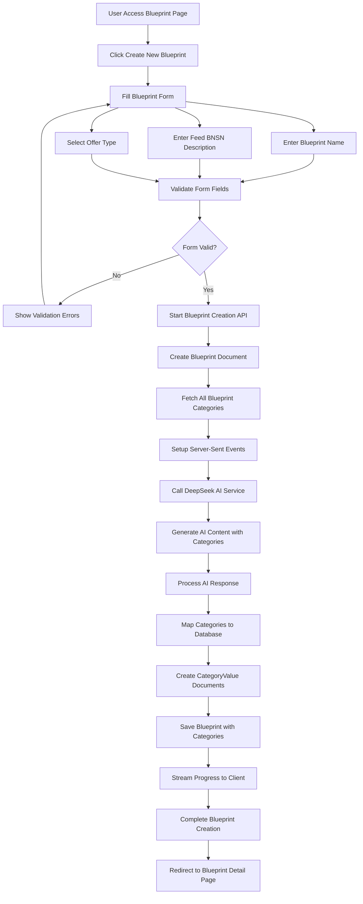
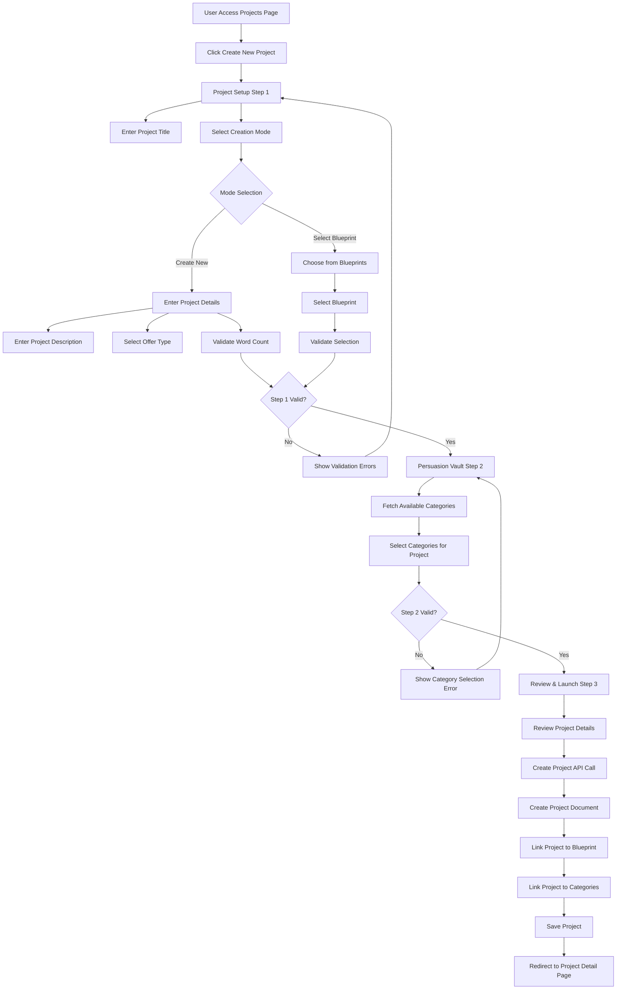
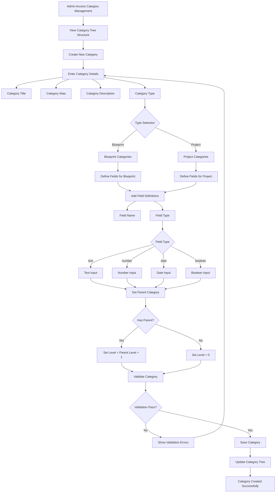
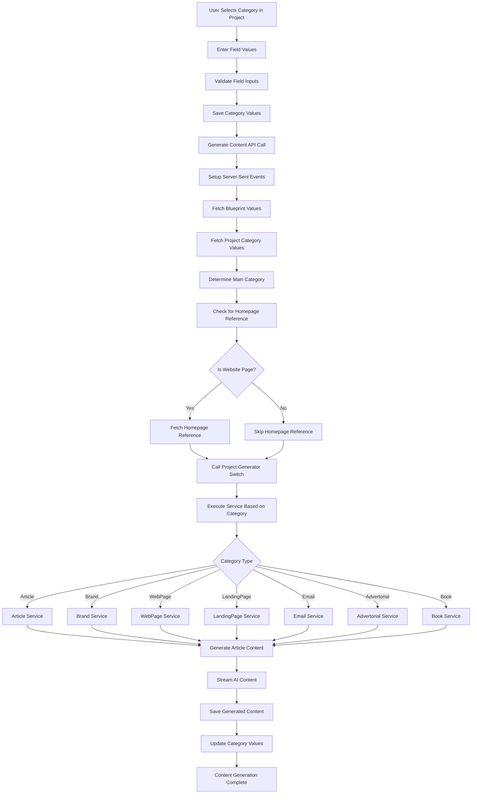
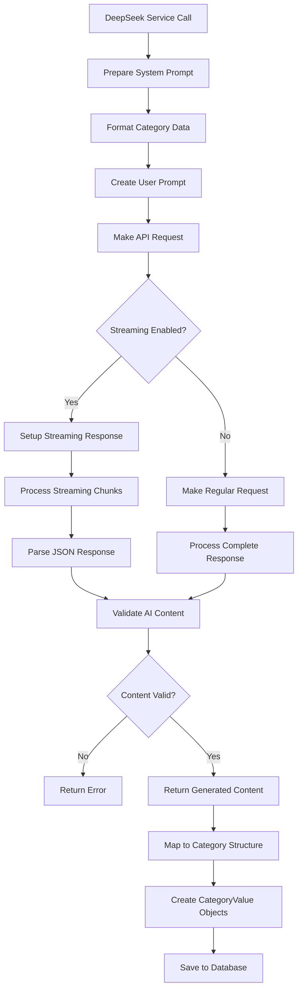

# System Flowchart: Blueprint Creation, Project Creation, and Categories Generation

## 1. Blueprint Creation Flow

## 2. Project Creation Flow

## 3. Categories Generation Flow

## 4. Project Content Generation Flow

## 5. DeepSeek AI Integration Flow

## Key Components and Relationships

### Database Models
- **Blueprint**: Contains title, description, offerType, userId, categories[]
- **Project**: Contains name, description, userId, blueprintId, categoryId[]
- **Category**: Contains title, alias, description, fields[], type, level, parentId
- **CategoryValue**: Contains category, project/blueprint, userId, value[]

### API Endpoints
- `/api/blueprints` - Blueprint CRUD operations
- `/api/projects` - Project CRUD operations  
- `/api/category` - Category management
- `/api/projects/generate` - Content generation

### Services
- **DeepSeekService**: AI content generation
- **ProjectGeneratorSwitch**: Routes to specific content generators
- **CategoryService**: Category management and validation

### Frontend Components
- Blueprint creation form with streaming progress
- Project creation wizard (3-step process)
- Category selection interface
- Content generation with real-time updates

This flowchart represents the complete system architecture for creating blueprints, projects, and generating categories with AI-powered content creation.
